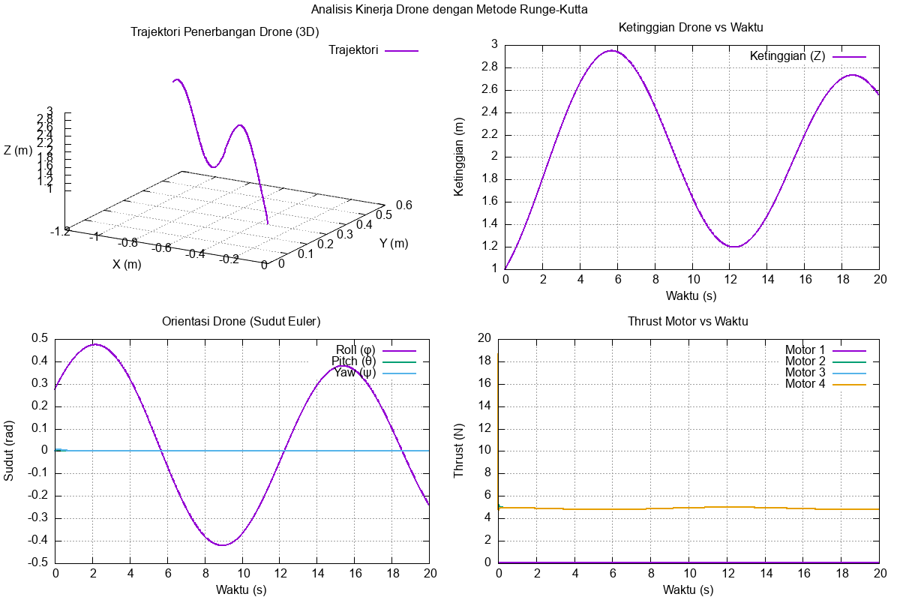

# Analisis Kinerja Drone Menggunakan Metode Runge-Kutta

## Informasi Pengembang
- **Nama Lengkap:** Daffa Sayra Firdaus
- **NPM:** 2306267151

## Deskripsi Program
Program ini mensimulasikan dinamika penerbangan drone menggunakan model matematika 6-DOF dan metode integrasi numerik Runge-Kutta orde 4. Simulasi ini bertujuan untuk menganalisis kinerja drone dalam mempertahankan ketinggian dan stabilitas orientasi saat mengikuti target ketinggian yang bervariasi.

## Model Matematika
Drone dimodelkan sebagai benda tegar dengan 6 derajat kebebasan. State vector drone didefinisikan sebagai:

$$\mathbf{x} = \begin{bmatrix} x \\ y \\ z \\ v_x \\ v_y \\ v_z \\ \phi \\ \theta \\ \psi \\ p \\ q \\ r \end{bmatrix}$$

Dimana:
- $(x,y,z)$: Posisi dalam koordinat global (m)
- $(v_x,v_y,v_z)$: Kecepatan linear dalam koordinat global (m/s)
- $(\phi,\theta,\psi)$: Sudut Euler - roll, pitch, yaw (rad)
- $(p,q,r)$: Kecepatan angular dalam body frame (rad/s)

### Persamaan Dinamika
Dinamika drone diatur oleh persamaan berikut:

1. **Dinamika Translasi**:
   $$m\dot{\mathbf{v}} = \mathbf{F}_{\text{thrust}} + \mathbf{F}_{\text{gravity}} + \mathbf{F}_{\text{drag}}$$

2. **Transformasi Gaya Thrust**:
   $$\mathbf{F}_{\text{thrust, global}} = \mathbf{R} \begin{bmatrix} 0 \\ 0 \\ -T \end{bmatrix}$$
   Dimana $\mathbf{R}$ adalah matriks rotasi dari body frame ke global frame.

3. **Gaya Gravitasi**:
   $$\mathbf{F}_{\text{gravity}} = \begin{bmatrix} 0 \\ 0 \\ mg \end{bmatrix}$$

4. **Gaya Drag**:
   $$\mathbf{F}_{\text{drag}} = -\frac{1}{2} \rho A C_d \|\mathbf{v}\| \mathbf{v}$$

5. **Kinematika Orientasi**:
   $$\begin{bmatrix} \dot{\phi} \\ \dot{\theta} \\ \dot{\psi} \end{bmatrix} = 
   \begin{bmatrix} 
   1 & \sin\phi\tan\theta & \cos\phi\tan\theta \\
   0 & \cos\phi & -\sin\phi \\
   0 & \sin\phi/\cos\theta & \cos\phi/\cos\theta 
   \end{bmatrix} \begin{bmatrix} p \\ q \\ r \end{bmatrix}$$

6. **Dinamika Rotasi**:
   $$\mathbf{I}\dot{\boldsymbol{\omega}} = \boldsymbol{\tau} - \boldsymbol{\omega} \times (\mathbf{I}\boldsymbol{\omega})$$

### Kontrol PID
Kontroler PID digunakan untuk menjaga ketinggian dan stabilitas:

1. **Ketinggian**:
   $$T = mg + K_p e + K_i \int e \, dt + K_d \frac{de}{dt}$$
   Dimana $e = z_{\text{target}} - z$

2. **Stabilitas Orientasi**:
   $$\tau_{\phi} = -K_{p,\phi} \phi - K_{d,\phi} \dot{\phi}$$
   $$\tau_{\theta} = -K_{p,\theta} \theta - K_{d,\theta} \dot{\theta}$$

## Alur Program
1. **Inisialisasi**:
   - Set parameter fisik drone (massa, inersia, dll)
   - Set state awal (posisi, kecepatan, orientasi)
   - Set parameter simulasi (durasi, time step)

2. **Loop Simulasi** (setiap langkah waktu $\Delta t$):
### Implementasi Runge-Kutta
Metode Runge-Kutta orde 4 diimplementasikan dalam fungsi `rungeKutta4()` ([`program.cpp:159`](program.cpp:159)) dengan langkah-langkah sebagai berikut:

$$\begin{align*}
k_1 &= \Delta t \cdot f(t_n, y_n) \\
k_2 &= \Delta t \cdot f(t_n + \frac{\Delta t}{2}, y_n + \frac{k_1}{2}) \\
k_3 &= \Delta t \cdot f(t_n + \frac{\Delta t}{2}, y_n + \frac{k_2}{2}) \\
k_4 &= \Delta t \cdot f(t_n + \Delta t, y_n + k_3) \\
y_{n+1} &= y_n + \frac{1}{6}(k_1 + 2k_2 + 2k_3 + k_4)
\end{align*}$$

Dalam kode program:
```cpp
void DroneSimulator::rungeKutta4(double dt) {
    std::vector<double> k1 = dynamics(state, control);
    for (auto& val : k1) val *= dt;
    
    std::vector<double> x_temp(state.size());
    for (size_t i = 0; i < state.size(); i++) {
        x_temp[i] = state[i] + k1[i] / 2.0;
    }
    std::vector<double> k2 = dynamics(x_temp, control);
    for (auto& val : k2) val *= dt;
    
    // Langkah k3 dan k4 serupa...
    
    for (size_t i = 0; i < state.size(); i++) {
        state[i] += (k1[i] + 2.0*k2[i] + 2.0*k3[i] + k4[i]) / 6.0;
    }
}
```
   ```plaintext
   while t < duration:
      1. Hitung target ketinggian: z_target = 2.0 + 0.5*sin(0.5*t)
      2. Update kontrol PID
      3. Hitung turunan state (ẋ) menggunakan fungsi dynamics()
      4. Integrasi state menggunakan Runge-Kutta 4:
         k1 = Δt * f(t, x)
         k2 = Δt * f(t + Δt/2, x + k1/2)
         k3 = Δt * f(t + Δt/2, x + k2/2)
         k4 = Δt * f(t + Δt, x + k3)
         x_{n+1} = x_n + (k1 + 2k2 + 2k3 + k4)/6
      5. Simpan data state dan kontrol
      6. Update waktu: t = t + Δt
   ```

3. **Visualisasi dan Analisis**:
   - Hasil simulasi divisualisasikan menggunakan GNU Plot
   - Analisis kinerja dihitung berdasarkan data simulasi

## Output Program
Program menghasilkan beberapa file output:
1. **`drone_data.txt`**: Data numerik hasil simulasi
2. **`plot_drone.gp`**: Skrip GNU Plot untuk visualisasi
3. **`drone_analysis.png`**: Grafik analisis kinerja
4. **Output Konsol**: Ringkasan hasil simulasi

## Hasil Simulasi dan Tuning
Setelah proses tuning PID, diperoleh parameter optimal:
- $K_p = 0.35$
- $K_i = 0.0$
- $K_d = 0.55$

Dengan parameter ini, drone dapat mengikuti target ketinggian sinusoidal dengan RMS error 30.57% dari tinggi referensi 2.0m.



```
===============================================
    SIMULATOR ANALISIS KINERJA DRONE
    Menggunakan Metode Runge-Kutta Orde 4
===============================================

Parameter Simulasi:
- Durasi: 20 detik
- Time step: 0.01 detik
- Metode integrasi: Runge-Kutta Orde 4
- Model: 6-DOF (6 Degrees of Freedom)

Memulai simulasi drone...
Durasi: 20s, Time step: 0.01s
Total steps: 1999

Progress: 0.0% - Height: 1.001m
Progress: 10.0% - Height: 1.799m
Progress: 19.9% - Height: 2.654m
Progress: 29.9% - Height: 2.942m
Progress: 39.8% - Height: 2.477m
Progress: 49.8% - Height: 1.672m
Progress: 59.7% - Height: 1.208m
Progress: 69.7% - Height: 1.454m
Progress: 79.6% - Height: 2.163m
Progress: 89.6% - Height: 2.692m
Progress: 99.5% - Height: 2.576m

Simulasi selesai. Data disimpan ke: drone_data.txt
Membuat visualisasi dengan GNUPlot...
Grafik berhasil dibuat: drone_analysis.png

=== ANALISIS KINERJA DRONE ===
1. Stabilitas Ketinggian:
   - Target ketinggian: 2.0000 m
   - RMS error ketinggian: 0.6112 m
   - Ketinggian min: 1.0014 m
   - Ketinggian max: 2.9500 m

2. Stabilitas Orientasi:
   - RMS Roll (φ): 0.0007 rad (0.0374 derajat)
   - RMS Pitch (╬╕): 0.0013 rad (0.0748 derajat)
   - Max Roll: 0.2826 derajat
   - Max Pitch: 0.5644 derajat

3. Kinerja Dinamik:
   - Kecepatan maksimum: 0.4796 m/s
   - Durasi simulasi: 19.9900 s
   - Jumlah data points: 2000

4. Evaluasi Kinerja:
   - RMS error ketinggian (persentase dari 2.0000m): 30.56%
   Γ£ô Kontrol ketinggian: BAIK (RMS error < 35%)
   Γ£ô Stabilitas orientasi: BAIK (< 6 derajat)

=== SELESAI ===

Untuk melihat hasil:
1. Buka file 'drone_analysis.png' untuk melihat grafik
2. Buka file 'drone_data.txt' untuk melihat data numerik
3. Script GNUPlot tersimpan di 'plot_drone.gp'
```